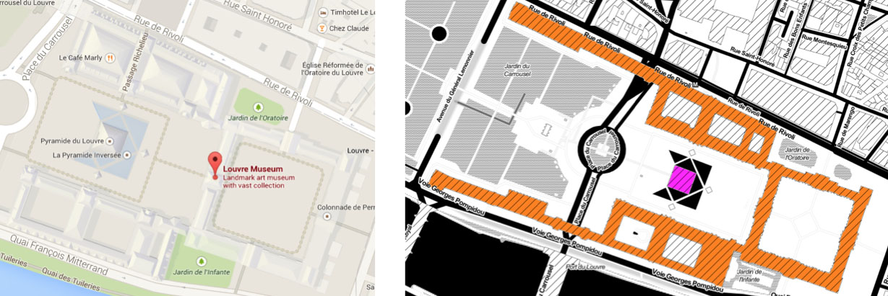

# Social Points of Interest from Online Photos #

## Overview ##

This repository contains the supplemental material (dataset) for the paper "Finding Social Points of Interest from Georeferenced and Oriented Online Photographs" by Bart Thomee, Ioannis Arapakis, David A. Shamma, currently under submission to _ACM Transactions on Multimedia Computing, Communications and Applications_.

##  Dataset ## 
The dataset is supplied as a set of ```R``` scripts and accompanying ```JSON``` objects. Each object represents the spatial footprint of a POI, and the script will render this region as a HTML page in an invoked browser window. In total, there are 105 footprints from various points of interest (POIs) around the world that were used as ground truth of the experiments described in the paper. The ```JSON``` objects are expressed as [GeoJSON multi-polygons][1], because this allows regions to be specified that can consist of more than one polygon and that may also contain holes. For example, while in the image below the Musée du Louvre is only represented as a single geographic coordinate by Google Maps (left), in reality it actually covers a relatively large area: its geographic footprint (right) consists of two polygons, of which one (the pyramid, shown in magenta) is convex and the other (the palace, shown in orange) is concave and contains multiple holes.

<p align="center"></p>

## Usage ##

Source the desired footprint's ```R``` file into memory (dependencies will be called automatically). Then calling the ```map``` variable will launch the footprint in your default browser.

Execute the following commands within ```R```:

```R
setwd("footprints")
source("Louvre.R")
map
```

## Dependencies ##

* [R][2]
* [rCharts][3]

## Copyright and license ##

The footprints have been obtained from [OpenStreetMap][4] and, if warranted, have been modified to correct for errors in their polygonal representations. We are in the process of contributing our modifications back to OpenStreetMap. OpenStreetMap is open data, licensed under the [Open Data Commons Open Database License][5], &copy; OpenStreetMap contributors. The data we present here in this repository bears the same copyright and license.

[1]: http://geojson.org/geojson-spec.html
[2]: http://www.r-project.org/
[3]: https://ramnathv.github.io/rCharts/
[4]: http://www.openstreetmap.org/
[5]: http://opendatacommons.org/licenses/odbl/1.0/
